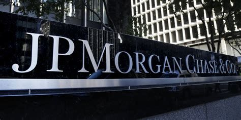

# class-activity-9.25.21

## JP Morgan Chase

---

JP Morgan Chase is an investment and banking firm that offers integrated financial services formed by M&A of other large banks and other financial services firms. Competitors include Deutsche, Bank of China, HSPC.

---

They are using intelligent automation to integrate bank processes, operational efficiency and enhanced customer service.
This includes the JPM Coin to facilitate payments between institutional customers using blockchain technology. Though they are historically a traditional finance firm they are growingly using technology to develop competetive advantages. 